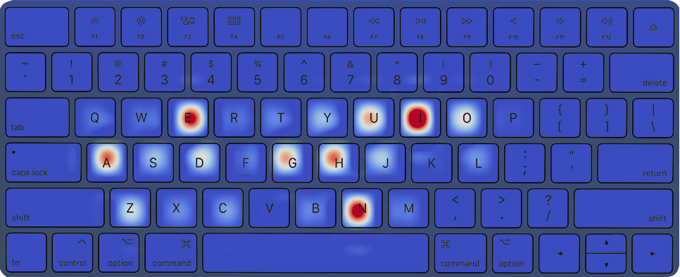
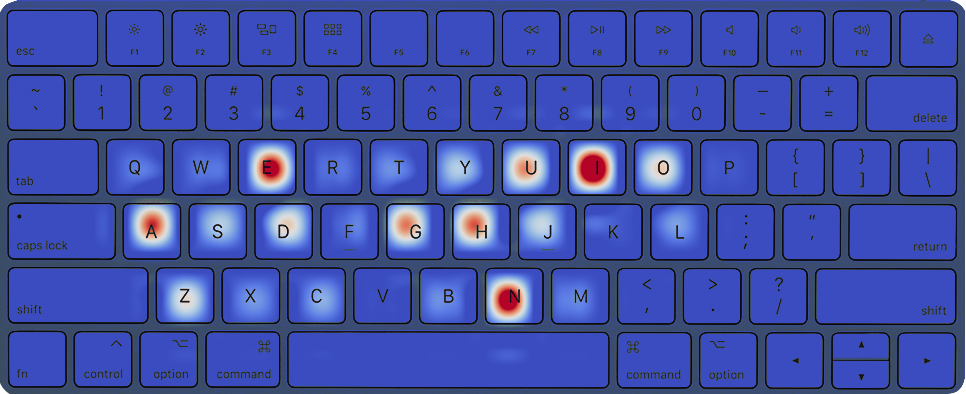
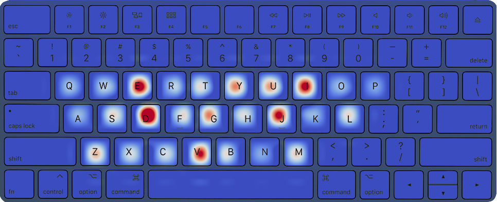
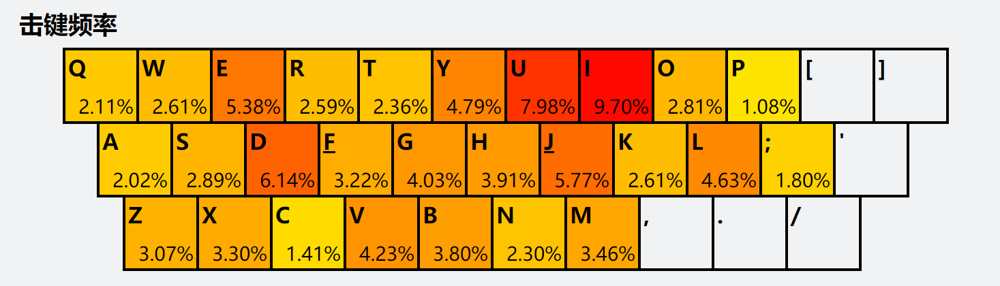
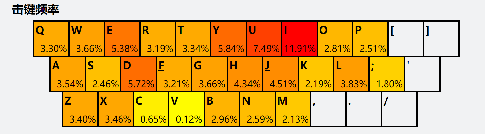
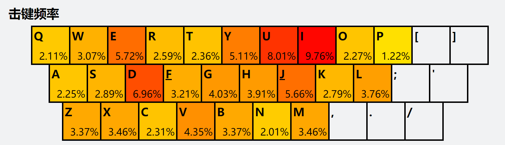

# 任务拆解

# 原题要求

**题目：高效均匀的打字编码方法**

由于不同汉字的使用频率和输入方式不同，使用全拼输入法撰写文章时，26个字母键盘的使用频率并不均衡。

假设给定一篇中文文章素材（附件文章），使用全拼输入法（不考虑词组缩写）输入这篇文章中的文字。

请你评价使用全拼时26字母按键的均衡性和输入效率，并尝试设计一种新的拼写编码方法，使得输入同样文章时按键使用更加均衡、输入更加高效。

具体要求：  

1. 给定一篇中文文章（附件中的文章），统计出使用全拼输入法录入这篇文章时26个字母键的使用频率，绘制热力图。  
	- 输入: 一篇中文文章（附件文章）  
	- 输出: 录入这篇文章的26字母键使用热力图  
2. 设计评价标准来分别评价使用全拼录入这篇文章时的按键使用均衡性和输入效率（请根据个人理解自行定义，建议使用明确的量化指标）。 
	- 输出: 量化评价标准或方法，以及对全拼输入方案的评价结果  
3. 基于你在题目2中制定的标准，尝试在全拼基础上改进打字编码方案，使得输入该文章时字母键的使用更加均衡、输入更加高效，展示改进的结果并分析。  
	- 输入: 一篇中文文章（附件文章）  
	- 输出: 新的打字编码方案、新旧方案在均衡性和输入效率方面的对比

说明：

题目只是我们后续交流的载体，没有标准答案，主要体现你的理解和思路。

其中涉及的“均衡”、“效率”等词，可以按照自己的理解进行定义和解释，量化、明确、自圆其说即可。


# 实现环境

任务中需要通过程序设计完成的部分包括PDF读取与转化，频率统计与量化指标的计算以及热力图绘制，使用python的虚拟环境及相关库可以在较短时间内实现。


最终新的可用输入法可以使用自制词库配合多多输入法生成器生成，做出实际上手的输入法。


# 绘制热力图

## 1. 读取PDF中的汉字

这里选用依然在维护的的PDFMiner.six库，该工具更专注于获取和分析文本数据，支持汉语系文字，虽然效率不如基于C/C++编写的工具，但是这里不考虑效率，所以可以忽略。

提取出的所有文字再通过正则表达式匹配所有中文并输出。

## 2. 汉字转拼音字母

使用简化的python库都无法解决多音字的匹配问题，因此这里不考虑多音字的情况。这里选用xpinyin库，可以直接输出字母字符串而不是列表，同时还可以指定首字母大写，为后面可能出现的逐字分析提供可能。

[超详细——python把中文汉字转成拼音xpinyin，pypinyin，snownlp三种方法_小琳爱分享的博客-CSDN博客](https://blog.csdn.net/qq_45708377/article/details/112723390)

## 3. 绘制26键使用热力图

使用tapmap库可以输入txt文件，直接统计各个字母出现频率并生成键盘热力图。




# 评价按键均衡性和输入效率

## 1. 量化评价指标

### 均衡性

由于26键键盘三排按键的敲击时间（难度）有差异，可把三排按键分开统计。将均衡度定义为输入样本过程中，不同区域按键出现次数归一化后求标准差之和。均衡度越小，均衡性越好。（暂时不考虑左右手及不同手指的按键差异）

$$
B = 
\sqrt{\dfrac{\sum_{j=1}^{10} (\dfrac{p_j}{\overline p_f}-1)^2}{9}}+
\sqrt{\dfrac{\sum_{i=1}^{9} (\dfrac{p_i}{\overline p_s}-1)^2}{8}}+
\sqrt{\dfrac{\sum_{k=1}^{7} (\dfrac{p_k}{\overline p_t}-1)^2}{6}} 
$$


- $B$: 均衡度
- $p_i$: 按键次数
- $\overline p_f$: 第一行平均按键次数
- $\overline p_s$: 第二行平均按键次数
- $\overline p_t$: 第三行平均按键次数

> 不加系数却分开计算的原因是希望两个评价维度相互独立的同时不相冲突。


### 输入效率

输入效率考虑用两个指标表征：

1. 平均单字击键数
	$$
	\overline N = \dfrac{N_k}{N_c}
	$$
	
	- $\overline N$: 平均单字击键数
	- $N_k$: 样本文章击键总数
	- $N_c$: 样本文章总字数
2. 平均单字耗时
	$$
	\overline T = \dfrac{\sum_i^{N_k} t_0 k_i}{N_c}
	$$
	
	- $\overline T$: 平均单字耗时
	- $t_0$: 单键敲击基本耗时
	- $k_i$: 键位修正参数，表征不同行键位敲击所用时间差异（第2行 < 第1行 < 第3行）

> 由于时间紧迫，无法考虑实际输入时不同区域按键误触率的问题。


## 2. 评价全拼输入

```Bash
Original pinyin decode
{'a': 4392, 'b': 711, 'c': 1047, 'd': 2427, 'e': 5313, 'f': 434, 'g': 3624, 'h': 4320, 'i': 7453, 'j': 1734, 'k': 167, 'l': 813, 'm': 629, 'n': 5777, 'o': 2736, 'p': 135, 'q': 441, 'r': 423, 's': 1565, 't': 631, 'u': 3671, 'v': 27, 'w': 448, 'x': 805, 'y': 1503, 'z': 2249}
Number of Chinese characters: 18118
Number of English letters: 53475
Average number of single word keystrokes: 2.9515
Average typing time of single word: 2.3248
Balance: 3.0691
```


# 改进编码

## 1. 改进方向

### 抛弃拼音类

以五笔和郑码为代表的输入方案，如五笔：

- 将汉字拆分成不同部件，再映射到不同按键上
- 每个汉字、词组都以不超过四次按键的编码进行编排，保证码长不会过长

共同问题：

- 学习成本：相较于拼音输入法的易用，以及拼音在九年义务教育中的普及，这样的学习成本毫无疑问会将很多的人阻挡在门外
- 编码的合理性。以五笔为例，虽然经过了86，98，新世纪等方案的改进，但其编码的合理性仍然存在着很多的争议。而且很多的复杂的字，拆起来存在着难度
- 普遍通过小词库来解决重码问题，对于很多的流行词以及后来的非标准词只能使用单字的输入方式 
### 简化拼音类

简拼：

简拼是一种通过使用汉字词组的首字母或者部分字母来进行词组/句子输入的一种方式。例如：nh → 你好，llq → 浏览器。问题也很明显：

- 无法覆盖所有的词组，只有常见的或者经常输入的才行
- 可能引入更多的重码

因此该方案通常可以用作全拼的补充而无法成为独立的输入方案。


双拼：

双拼就是把全拼的声韵母压缩成两键来表示，一键声母一键韵母。在全拼中，每个字都需要声母和韵母组成，但声母和韵母所需要输入的字母个数是不一定的，从一个到三个不等，按键时就需要进行多次输入才能组成一个声母或韵母。而双拼对其进行规范化，无论是声母还是韵母，都各自集合在一个按键上，即把声母中 zh、ch、sh 和 非单字母韵母（ong、iong、uang 等）进行重新编排，使每个声母或者韵母都对应一个按键。


### 并击输入

并击的原理可以用三句话简单概括：

1. 并击等同于左右手分别控制一个完整的键盘
2. 左右手按键中缺少的键均由双键同时按下来实现
3. 规定左手打第一码，右手打第二码，左右手同时按称作“并击”

并击是通过一次同时按下2~4个键来输出两个字符的方式提高打字效率，其理论提速空间和极限速度超过单击是毋庸质疑的，因此职业速录界均采用此方法。但是并击对左右手协调、反应速度以及并击映射表的记忆有很高的要求，普通用户需要大量练习才能达到或者超过单击输入法的输入速度。在该任务中，如果采用并击输入方式可能可以在一定程度上改善均衡性，但在输入效率方面必然落后于全拼，因此不考虑。


### 音形码方案

这一类方案一般来说都是在拼音的基础上，使用形码来进行选重。虽然音形码可以有效降低重码率，但这并不是本任务所关心的拼写编码方式的改进。


## 2. 改进方案

由于题目要求基于之前指定的均衡性和效率的评价标准下在全拼基础上改进编码方案，因此所有非拼音类方案被抛弃。

基于标准全拼方案，有改进方向：

1. 由于一篇文章的主题相对固定，因此主题词及相关词汇出现频率较高，可以采用首字母缩写的方式替代，即生成个性词库。该方案针对特定主题能够在一定程度上减少平均单字击键数，且学习成本较低。

基于双拼方案（以小鹤双拼为例），是将所有拼音拆成声母和韵母两个部分（介母与韵母合并）。

声母有23个，而所有零声母音节只能由“aoe”三个字母开头，这样总共26种情况且每种的首字母都不相同，刚好用完26键。考虑到学习成本，这里不做改动。

介母韵母一共30个，可通过调整映射方案提高均衡性和输入效率。

零声母音节可分三种情况：

1. 双字母保持全拼方式，如：ai en ou er
2. 一字母为按下两次首字母：a(a+a), o(o+o), e(e+e)
3. 三字母为首字母+韵母所在键：ang(a+h), eng(e+g)

零声母音节的处理比较符合常理认知，同时也保证了码长的统一性，且零声母音节出现频次较少，改进效果不明显，因此这里也不做修改。


## 3. 新方案实现

基于全拼方案的改进，可通过python的字典结构，对之前处理好的拼音字符串进行替换。

基于双拼方案的改进，也可通过类似的方式进行替换，但要注意替换顺序，如声母的替换必须放在前面，介母韵母的替换必须按照从长到短依次替换，否则可能会出现错误替换。

介母韵母的映射方案可对所有常用文字统计声母和韵母的出现频率，出现频率较高的声母对应的按键可映射给出现频率较低的介母韵母，同时考虑三排按键的优先级进行映射。

由于时间紧迫，且未能找到声母韵母出现频率的可靠统计数据资料，因此改进方案采取个人词库和小鹤双拼与原全拼方案进行对比，生成输入法的计划暂时搁置。


## 4. 新旧方案对比

改进前：

```Bash
Original pinyin decode
{'a': 4392, 'b': 711, 'c': 1047, 'd': 2427, 'e': 5313, 'f': 434, 'g': 3624, 'h': 4320, 'i': 7453, 'j': 1734, 'k': 167, 'l': 813, 'm': 629, 'n': 5777, 'o': 2736, 'p': 135, 'q': 441, 'r': 423, 's': 1565, 't': 631, 'u': 3671, 'v': 27, 'w': 448, 'x': 805, 'y': 1503, 'z': 2249}
Number of Chinese characters: 18118
Number of English letters: 53475
Average number of single word keystrokes: 2.9515
Average typing time of single word: 2.3248
Balance: 3.0691
```


改进后：

在仅使用包含十个项目的词库替换缩写之后，再次评价的结果就已经有了比较可观的进步，但热力图没有明显变化。

平均单字击键数减少0.24次，下降8.0%，平均单字敲击时间减少0.19秒，下降8.0%；

均衡度减少0.18，下降5.9%

```Bash
Recode based on Quanpin
Number of Chinese characters: 18118
Number of English letters: 49192
Average number of single word keystrokes: 2.7151
Average typing time of single word: 2.1382
Balance: 2.8874
```





在使用词库替换的基础上，采取小鹤双拼方案。由于单字码长固定为2，所以击键总数大幅下降。观察热力图结合均衡性指标也可以发现，该方案各键使用频率较为均衡，且相对频率较高的按键集中在第一排和第二排靠中间的位置，手指敲击更为流畅自然。

平均单字击键数相对标准全拼方案减少1.15次，降低幅度39.0%；平均单字敲击时间减少0.90秒，降低幅度38.9%.；均衡性指标减少 1.50，降低幅度48.9%

```Bash
Recode based on Shuangpin
Number of Chinese characters: 18118
Number of English letters: 32620
Average number of single word keystrokes: 1.8004
Average typing time of single word: 1.4215
Balance: 1.5694

```





这里还同时尝试了紫光双拼和搜狗双拼方案，这两种方案都引入了非字母按键“；”，且零声母都是“o”+对应韵母按键来表示；但之前设计的评价标准代码中没有考虑非字母按键，所以计算出的结果会偏小；然而依然与小鹤双拼没有太大差距，且因为引入了新的按键提升了学习成本，总体来说此方向改进意义不大。

```Bash
Recode based on ZiguangShuangpin
Number of Chinese characters: 18118
Number of English letters: 32861
Average number of single word keystrokes: 1.8137
Average typing time of single word: 1.4200
Balance: 1.5339

Recode based on SougouShuangpin
Number of Chinese characters: 18118
Number of English letters: 32528
Average number of single word keystrokes: 1.7953
Average typing time of single word: 1.4099
Balance: 1.4221
```


# 结论

现有全拼方案对于从小就学习拼音的大部分人来说几乎没有上手难度，现代绝大多数的输入法都带有自学习的个人词库功能，配合少量练习能够小幅提高输入效率，按键使用均衡性提升有限；但如果采用全拼类方案，拆分拼音并不困难，只需要记住仅30个介母韵母在键盘上的排布，再加上一段时间的练习，就能得到均衡性和输入效率的巨大提升，这对于需要长期进行大量文字工作的人群来说是非常值得尝试的效率提升方式。

在几种常见的双拼方案中，主要的区别基本都在于键位的改动，如紫光双拼和搜狗双拼增加了非字母按键略微提升了学习成本，但没有太大改进；相比之下小鹤的键位布置比较合理，左右手能够比较均衡的负担输入任务，边角位置的减少使用也能让小拇指轻松一点。

虽然仍然可对所有常用文字词频统计声母和韵母的出现频率，出现频率较高的声母对应的按键可映射给出现频率较低的介母韵母，并同时考虑三排按键的优先级进行映射。这样也许还能在均衡性上有一定的提升空间，但考虑到全拼到双拼的巨幅效率提升，如果完全站在数据的角度思考修改方案就完全忽略了人的学习成本及出错可能，不如将更多的精力花在如何使初学者更快入门，如小鹤双拼的口诀记忆或是小程序（PC端跟打器）帮助练习。


搜狗双拼击键频率（字频数据来源不可靠）：



紫光双拼击键频率（字频数据来源不可靠）：



小鹤双拼击键频率（字频数据来源不可靠）：




# 参考资料

[一文说明白各类汉字输入方案 - 哔哩哔哩 (bilibili.com)](https://www.bilibili.com/read/cv15299984/)

[小鹤指引 · 学双拼 (flypy.com)](https://help.flypy.com/#/xup)

[并击输入是什么？它与五笔、拼音有何异同？ | 雪星实验室 (snomiao.com)](https://lab.snomiao.com/SNOLAB-4807)

杨飞洪, 李姣. 拼音输入法在电子病历录入中的输入效率差异[J]. 中华医学图书情报杂志, 2019, 28(9): 58-63.

[做少数派中的少数派：双拼输入快速入门 - 少数派 (sspai.com)](https://sspai.com/post/32809)

[efficient-pinyin-keys/main.md at main · helloangus/efficient-pinyin-keys (github.com)](https://github.com/helloangus/efficient-pinyin-keys/blob/main/src/main.md)

[双拼布局的统计计算 (tiansh.github.io)](https://tiansh.github.io/lqbz/sp/)

王士运. 一种双拼输入法:. 

